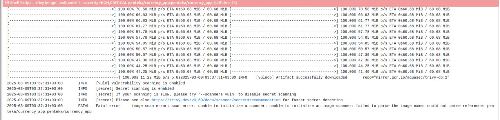
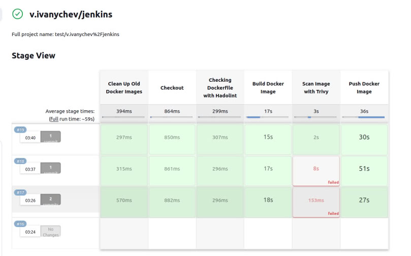
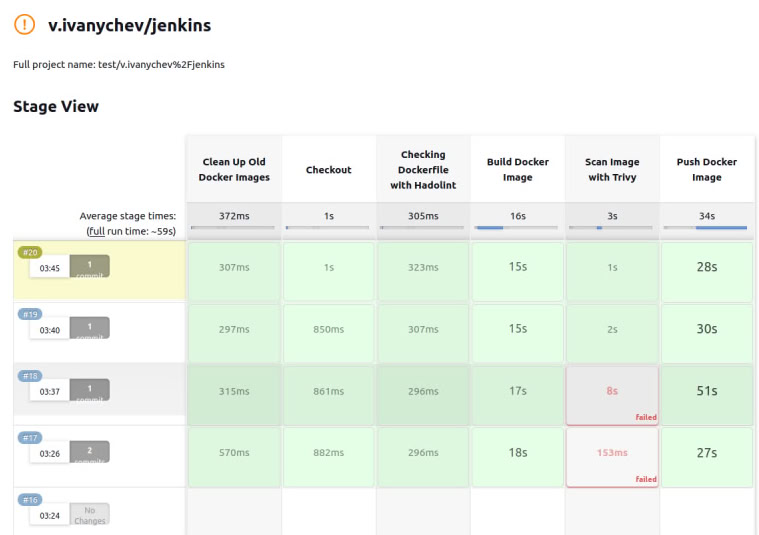
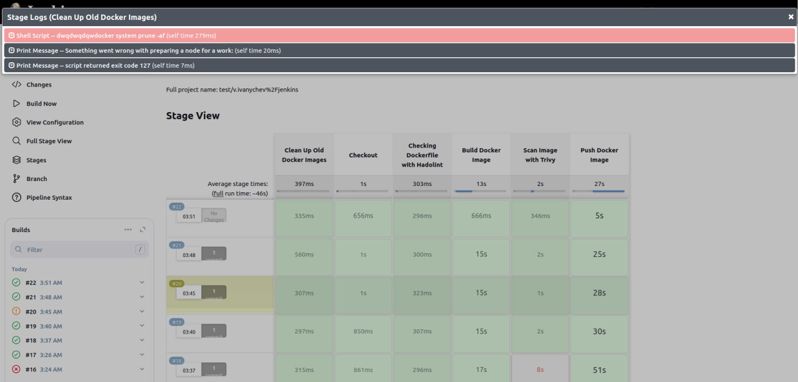

# Отчёт по выполненному ДЗ

## 1) Подготовка ноды, установка нужных пакетов и Jenkins

Всё делал по официальным инструкциям. В моём случае мне нужно было установить:

1. Java
2. Jenkins
3. Hadolint
4. Trivy
5. Docker

Сначала я думал, что нужно проверять и устанавливать Docker непосредственно в пайплайне, но позже разобрался в юзкейсах и понял, что для такого обычно используется Ansible (тема следующей лекции). После установки на ноду вешается тег (например, `docker`), и уже контроллер может отправить job на ноду с таким тегом.

Поэтому все нужные мне вещи я установил локально. Во время установки Hadolint возник конфликт пакетов, и тогда я особенно осознал необходимость использования Ansible, ведь я ставил пакеты на один хост, а если бы их было 50?

---

## 2) Чтение документации и осознание разницы между declarative/scripted pipeline

Далее я изучал документацию Jenkins, чтобы закрепить материал с лекции. Меня удивило, что написание scripted pipeline считается более сложной задачей. В документации прямо указано, что это материал уровня "advanced".

Также мне показалось забавным, что есть специальный блок `script`, который позволяет запускать блоки кода в scripted pipeline в декларативном виде. Таким образом, когда выполняется код, запускается декларативный пайплайн.

---

## 3) Интеграция с GitLab, установка плагинов

Делал всё по лекции, особых проблем не возникло. Однако долго не мог понять, что после выполнения job в GitLab CI/CD необходимо запускать job в Jenkins, чтобы подтянуть изменения в GitLab CI/CD.

---

## 4) Написание пайплайна и основные моменты

Сначала написал самые простые `step`, чтобы проверить работоспособность пайплайна. Затем добавил более сложную логику и обработку ошибок.

Протестировал, как ведёт себя пайплайн:

1. Pipeline не падает, если проверка на уязвимости не пройдена.

2. Pipeline получает статус `UNSTABLE`, если Dockerfile не проходит линтер.

3. Pipeline не падает, и `step` имеет статус `SUCCESS`, даже если что-то пошло не так.

---

## 5) Добавление Shared Library

Создал новую репозиторий, переписал все желаемые `step` на Groovy, прокинул креды и вызываю их в пайплайне просто по именам скриптов.

Понятно, что скрипты пока простые, но цель была протестировать Groovy и понять, как всё совмещается между собой.

