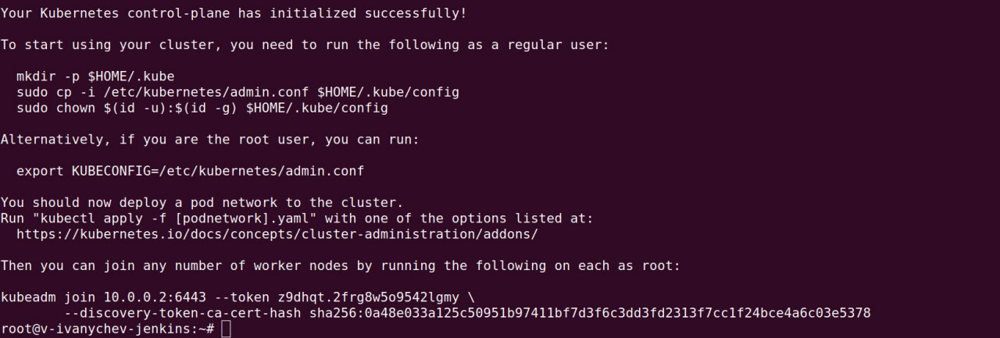

# Отчёт по выполненному ДЗ

## 1) Подготовка всех хостов

Сначала ввёл команду
```
sysctl net.bridge.bridge-nf-call-iptables net.bridge.bridge-nf-call-ip6tables net.ipv4.ip_forward
```
Получил вот такой вывод


Исправил вот так
```
sudo modprobe br_netfilter

echo "br_netfilter" | sudo tee /etc/modules-load.d/br_netfilter.conf

echo "net.bridge.bridge-nf-call-iptables=1" | sudo tee -a /etc/sysctl.conf
echo "net.bridge.bridge-nf-call-ip6tables=1" | sudo tee -a /etc/sysctl.conf
echo "net.ipv4.ip_forward=1" | sudo tee -a /etc/sysctl.conf

sudo sysctl -p

sysctl net.bridge.bridge-nf-call-iptables net.bridge.bridge-nf-call-ip6tables net.ipv4.ip_forward
```
Вывод был ожидаемым, так что идём дальше.

---

## 2) Инициализация кластера

```
kubeadm init --pod-network-cidr 192.168.0.0/16    --cri-socket=unix:///var/run/crio/crio.sock
```

Получаем такой замечательный вывод

Далее прописываем:

```export KUBECONFIG=/etc/kubernetes/admin.conf ```

После этого появляется наша первая нода с ожидаемым State = NotReady
---

## 3) Calico

Fun fact: даже под эстонским айпишником сайт тигеры + доки меня упорно блочил =)

```
kubectl create -f https://raw.githubusercontent.com/projectcalico/calico/v3.25.2/manifests/tigera-operator.yaml
kubectl create -f https://raw.githubusercontent.com/projectcalico/calico/v3.26.1/manifests/custom-resources.yaml
```
## 4) Подключение узлов и Test ping busybox

Вводим на обоих узлах команду, любезно нам предложенную после старта кластера и получаем ожидаемое.


Далее запускаем busybox

``` kubectl run -it --tty test --image=busybox -- sh ```

Получаем заветное


